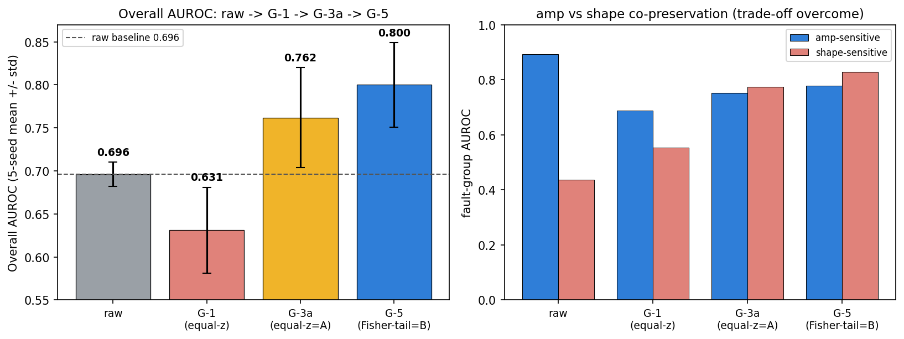

# G 트랙 최종 요약 — 핵심 비교표 (`claude/g-final`)

> 5-seed [2024·2025·2026·2027·2028] × 24 fold(4 split × 6 LONO) mean±std. AUROC primary.
> threshold = val-normal score 95pct 고정(test 라벨 튜닝 없음). raw = B3 flow_NLL.
> 최종 채택 = **G-3a 학습 구조 + G-5 Fisher-tail fusion**. 재현 경로 `report_G_final_pipeline.md`.

---

## 1) 핵심 비교표 — fusion final score 진행 (동일 성격 비교)

네 열 모두 **window-level 최종 이상점수**(threshold를 실제로 거는 대상). fusion 규칙과 학습 구조를
한 번에 한 축씩 바꿔 개선 원천을 분리한다:

- raw → **G-1**: scalar 진폭 disentangle + **equal-z** fusion (구조 최초 시도)
- G-1 → **G-3a**: 진폭 target을 scalar → **6-band**로 확장 (fusion 동일 equal-z) → *구조 개선 효과*
- G-3a → **G-5**: 구조 동일(6-band) · fusion을 equal-z → **Fisher-tail**로 교체 → *fusion 개선 효과*

| 지표 | raw | G-1 (equal-z) | G-3a (equal-z=A) | **G-5 (Fisher-tail=B)** |
|---|---|---|---|---|
| **전체 AUROC** | 0.696±0.014 | 0.631±0.050 | 0.762±0.058 | **0.800±0.049** |
| amp-sensitive fault | 0.892±0.006 | 0.688±0.035 | 0.752±0.040 | 0.779±0.039 |
| shape-sensitive fault | 0.436±0.033 | 0.554±0.074 | 0.775±0.087 | 0.828±0.071 |
| zero-support 외삽 | 0.669±0.020 | 0.612±0.070 | 0.736±0.079 | 0.778±0.072 |
| compositional | 0.777±0.021 | 0.688±0.084 | 0.840±0.059 | 0.866±0.048 |
| 정상 FPR 고진폭 | 0.528±0.010 | 0.171±0.052 | 0.151±0.029 | 0.155±0.028 |
| 정상 FPR 저진폭 | 0.095±0.004 | 0.334±0.035 | 0.323±0.028 | 0.418±0.035 |
| ρ(RMS, score) | 0.966±0.005 | -0.317±0.120 | -0.280±0.071 | -0.334±0.085 |

**읽는 법.**
- **G-1(equal-z) 0.631 < raw 0.696 = NO-GO.** scalar 조건부 진폭은 개념만 견고(진폭 confound는 제거: ρ 0.966→-0.32, 고진폭 FPR 0.528→0.171)하고 순 AUROC 개선은 실패.
- **G-3a(equal-z) 0.762 > raw = 구조 개선이 결정적.** 진폭 target을 6-band로 늘리자 fusion이 그대로여도 amp↔shape 동시보존(0.752/0.775)이 처음으로 성립 → G 트랙 최초 baseline 순개선.
- **G-5(Fisher-tail) 0.800 = fusion 개선이 추가 이득.** 구조·checkpoint 불변, 결합식만 tail 확률 기반으로 바꿔 전체 AUROC·두 fault군·두 fold유형 **모두** A 이상. B>A가 5/5 seed 전부.

> 참고(branch 단독, 비-fusion): G-1 `S_shape` 0.704±0.069 ≈ raw, G-3a `S_shape` 0.776±0.047. shape branch만으로도
> G-3a는 두 fault군 견고(0.756/0.803) — 6-band amp의 auxiliary gradient가 shape encoder까지 개선(G-3b detach로 인과는 미입증).



*좌: 전체 AUROC 진행(raw→G-1→G-3a→G-5). 우: amp/shape-sensitive 동시보존 — raw의 극단 트레이드오프(0.892/0.436)가 G-3a·G-5에서 해소.*

---

## 2) 최종 채택 성능 (G-3a 구조 + Fisher-tail)

- **전체 AUROC 0.800±0.049** (raw 0.696 대비 +0.104, std보다 큰 폭).
- amp-sensitive 0.779 / shape-sensitive 0.828 **동시보존** (raw는 0.892/0.436으로 shape형에 무력 → 트레이드오프 극복).
- fold유형: zero-support 외삽 0.778 / compositional 0.866 (각 raw +0.11·+0.09).
- 진폭 confound 제거 유지: ρ(RMS,score) -0.334 (raw 0.966), 고진폭 정상 FPR 0.155 (raw 0.528).
- per-fault 하이라이트: shape형 KA22 0.229→0.836·KI17 0.545→0.881 대폭 회복, amp형 KA04 0.922·KB24 0.855 유지.

---

## 3) 남은 limitation (조건부 GO인 이유)

1. **저진폭 정상 FPR 악화**: 0.095(raw) → 0.323(A) → **0.418(B)**. 120셀 중 77%·5/5 seed 일관 = 실질 악화.
   원인 = val(저진폭)↔test(고진폭) 진폭 분포 shift 축. Fisher-tail이 이 축을 더 민감하게 만듦(`report_G5_fpr_consistency.md`).
   → 후속 **pseudo-LOSO**가 정확히 이 저진폭 축을 겨냥.
2. **일부 amp-sensitive fault 회복 실패**: KA30 `S_amp`≈0.35 / KI04 `S_amp`≈0.35 → fusion 후에도 KA30 0.588·KI04 0.604로 낮음.
   조건부 진폭이 이 결함군의 미세 진폭 이상을 못 잡음(G-6 fixed-variance로도 개선 실패, refuted).
3. **PU 자체가 순수 외삽**(zero-support 3 split): source에 전무한 축을 맞히는 문제라 상한 존재. 데이터가 주 제약(CATCH 교차검증에서 확인).

---

## 4) 종료된 실험 (NO-GO — 채택 구조 변경 없음)

| 실험 | 브랜치 | 개입 | 결과 | 리포트 |
|---|---|---|---|---|
| G-2a | `claude/g2a-gated-fusion` | scalar S_amp reliability gate fusion | gate 열면 shape-sensitive 0.580 붕괴 | `report_G2a_gated_fusion.md` |
| G-3b | `claude/g3b-detach` | amp NLL gradient detach (auxiliary 가설 인과검증) | S_shape gain 원천 미입증(분산 이내) | `report_G3b_detach_screening.md` |
| G-4 | `claude/g4-amp-head` | amp head wider / LayerNorm | C=trade-off 재발, B=분산 이내 + 고분산 재배치 | `report_G4_amp_head_screening.md` |
| G-6 | `claude/g6-fixed-var-amp` | amp head fixed-variance(σ=1, MSE형) | 겨냥한 KA30/KI04 오히려 악화, Fisher flat(+0.003) | `report_G6_fixed_var_screening.md` |

> 실패 브랜치는 **삭제 없이 보존**. 위 리포트·분석 코드는 `claude/g-final`에도 수집됨(g2a/g3b/g4 분석 스크립트 포함).

---

## 5) 재현성 (sanity — 검증됨)

`claude/g-final`에서 per-window 캐시(`g3a_window_scores/*.npz`, 120)만으로 Step 3~4(CPU, 학습·GPU 없음)를 재실행:

- fusion_A(equal-z)가 기존 diag_G3a `auroc_total`을 **전 fold `repro Δ = 0.00e+00`**(120셀) — 캐시·재구현이 G-3a 원본과 정합.
- 재생성한 `report_G5_tail_fusion_5seeds.md`가 커밋본과 **byte-identical**(`git diff` 무차이).
- 재집계 overall: raw 0.696±0.014 / S_shape 0.776±0.047 / S_amp 0.652±0.011 / A 0.762±0.058 / **B 0.800±0.049**, `repro_max|Δ|=0.00e+00`.

재현 명령:
```bash
cd MTGFLOW/analysis
for s in 2024 2025 2026 2027 2028; do conda run -n mtgflow python diagnose_G5_tail_fusion.py --seed $s; done
conda run -n mtgflow python report_G5_5seeds.py --seeds 2024 2025 2026 2027 2028
```
